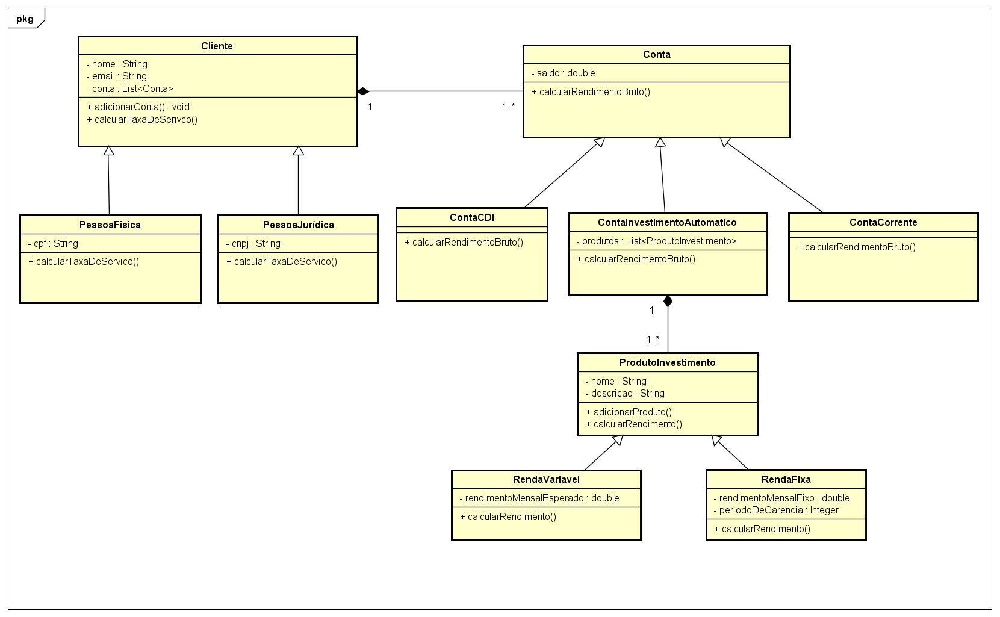

## Introdução

### 1.0 Arquitetura Base
- **Padrão de Projeto Principal**: Orientação a Objetos com uso de herança e polimorfismo
- **Modularização**: Separação das entidades de negócio (Clientes, Contas e Produtos de Investimento)
- **Extensibilidade**: Uso de classes abstratas para  futuras implementações
- **Uso de dados mockados para teste**: Uso da classe `Mock.Java` para testar os dados na `Main.java`

### 2.0 Hierarquia de Classes

#### Clientes
- **Classe Base**: `Cliente` (abstrata)
  - Atributos base: nome, email, Lista de contas associadas
  - Métodos: Método para cálculo de taxa de serviço adicionar conta
- **Especializações**:
  - `PessoaFisica`: estende de cliente e possui sua própria taxa de serviço
  - `PessoaJuridica`: estende de cliente e possui sua própria taxa de serviço

#### Contas
- **Classe Base**: `Conta`
- **Tipos Especializados**:
  - `ContaCorrente`: O método calcularRendimentoBruto retorna 0 pois a conta corrente não rende financeiramente.
  - `ContaCDI`: Além dos dados especificados nos requisitos, o atributo CDI  foi definido por mim como 10% ano como `private static final double CDI = 0.10.` Após isso temos métodos para calcularRendimentoBruto e  calcularRendimentoBruto.
  - `ContaInvestimentoAutomatico`: Como se trata da automatização de investimentos, nesse arquivo, recebemos uma lista de investimentos e dividimos automaticamente o saldo recebido pela quantidade de produtos.  `saldo / produtos.size()`

#### Investimentos
- **Classe Base**: `ProdutoInvestimento`
- **Tipos**:
  - `RendaFixa`: Investimentos com retorno previsível. é realizado o cálculo do rendimento levando em conta o cálculo da carência através do saldo alocado.

  - `RendaVariavel`: Investimentos com retorno variável. Igualmente a RendaFixa retorna o saldo alocado para o cálcul odo rendimento.

  ### 3.0 Diagrama de Classes

  

